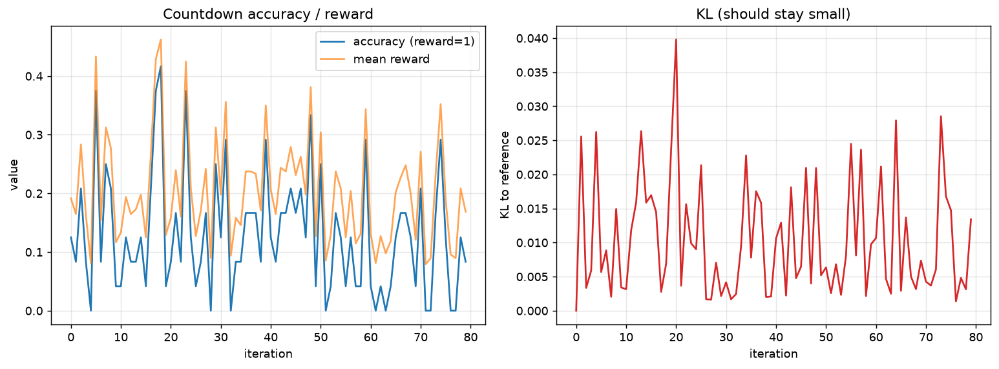

# grpo-countdown

**GRPO (the R1-style RL algorithm) implemented from scratch, trained on the verifiable Countdown task.**

Large reasoning models like DeepSeek-R1 are trained with **GRPO** (Group Relative
Policy Optimization): sample a group of answers per prompt, score each with a
reward, and push the policy toward the above-average answers — no value network,
no learned reward model. This repo implements that loop from scratch on
**Countdown** (reach a target number from a few given numbers using arithmetic),
a task whose reward is *verifiable*: you can check an answer exactly by evaluating
it. A small model (0.5–1.5B) learns to reason its way to correct expressions.

> Companion to [triton-llm-kernels](https://github.com/Anetisa/triton-llm-kernels).
> Built the same way: every component is validated on CPU with tiny tensors/models
> before spending a minute of GPU time — only the final training run needs a GPU.

## Status

Built incrementally; each piece is tested on CPU as it lands.

- [x] **Countdown task + verifiable reward** — safe (`ast`-based, no `eval`), *graded* reward
      (format / valid-numbers / correct), guaranteed-solvable generation, exploit tests
- [x] **Group-relative advantage** — per-group reward normalization; degenerate-group + property tests
- [x] **GRPO loss** — PPO-clipped policy gradient + k3 KL to reference; gradient-direction test
- [x] **Rollout + training loop** — batching/masks, update step; toy-model CPU tests
- [x] **Training run** on Qwen2.5-1.5B — GRPO trains stably with KL under control
      (loop uses the model's chat template + a one-shot format example; see [Results](#results))
- [x] Write-up: [the math of GRPO](docs/grpo.md)

## Results

Trained **Qwen2.5-1.5B-Instruct** with GRPO on Countdown-3 (reach a target from
three numbers), 80 iterations on one A100. The point of this run is to show the
implementation **trains stably**, not to chase a record solve rate.



What the curves show, honestly:

- **KL stays under control the whole run** (< 0.04, mostly ~0.01, no upward
  drift). This is the thing to get right in GRPO — the policy improves without
  running away from the reference or collapsing. Earlier runs with too-high a
  learning rate saw KL blow up to >2; tuning `lr` to `2e-7` fixed it.
- **Reward sits around ~0.2 and accuracy around ~0.13**, noisy (the batch is
  small, so per-iteration values swing a lot). Over 80 iterations there's **no
  strong upward trend** — the 1.5B model already does basic arithmetic, so it
  starts capable and these iterations mostly *hold* that level under a stable KL
  rather than climbing. A pronounced learning curve would need a harder task
  (lower starting point), many more iterations, and more tuning — beyond the
  scope of demonstrating a correct GRPO.

In short: the mechanism works end-to-end on a real model — verifiable reward →
group-relative advantage → clipped policy gradient with a KL leash — and it's
numerically stable. That's what this repo sets out to show. The full metric log
is in `results_train.jsonl`; regenerate the plot with
`python scripts/plot_training.py results_train.jsonl`.

## Why Countdown

The reward is exact and cheap: parse the model's expression, check it uses the
allowed numbers and evaluates to the target. No reward model to train, no human
labels — the perfect setting to study RL on reasoning at small scale (à la
TinyZero). Because model output is untrusted, expressions are evaluated over a
strict arithmetic whitelist with `ast`, never `eval`.

## Quickstart

```python
import random
from grpo_countdown import generate_problem, format_prompt, compute_reward

prob = generate_problem(random.Random(0))     # numbers + target, guaranteed solvable
print(format_prompt(prob))                     # the instruction shown to the model

# a model completion is scored 0.0 / 0.1 (format) / 1.0 (correct):
compute_reward("<answer>11 + 7 * 2</answer>", prob)
```

## Install

```bash
pip install -e ".[dev]"     # core + tests
pip install -e ".[train]"   # adds transformers/datasets for real training
```

## Test

```bash
make test    # runs on CPU; no GPU needed for the logic
```

## Train

Everything except this step is validated on CPU; the run itself needs a GPU.

```bash
pip install -e ".[train,dev]"
python -m grpo_countdown.train \
    --model Qwen/Qwen2.5-1.5B-Instruct --n-numbers 3 \
    --iterations 80 --prompts-per-iter 4 --group-size 6 \
    --max-new-tokens 200 --beta 0.1 --lr 2e-7 \
    --log-file results_train.jsonl
python scripts/plot_training.py results_train.jsonl --out assets/training_curve.png
```

Batch size drives memory; drop `--group-size` / `--max-new-tokens` if you OOM,
raise `--beta` or lower `--lr` if KL climbs.

## References

- Shao et al., *DeepSeekMath* (2024) — introduces GRPO
- DeepSeek-AI, *DeepSeek-R1* (2025)
- TinyZero — minimal Countdown RL reproduction

## License

MIT — see [LICENSE](LICENSE).
